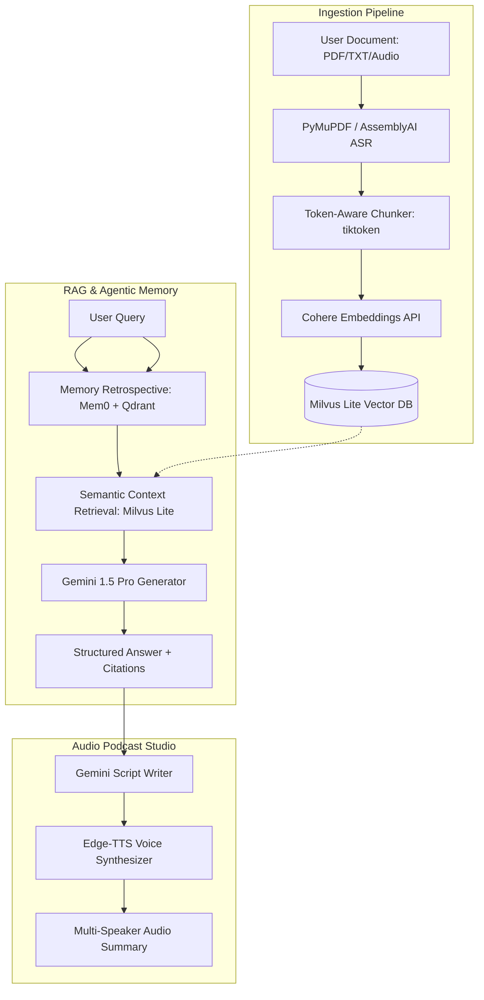

# 📓 NotebookLM Clone

<p align="center">
  
  
  
  
  
  
  
</p>

An open-source, local-first implementation of Google's **NotebookLM** that grounds AI responses in your private documents with page-level citations. Built with modern agentic architectures, multi-speaker podcast generation, and a cognitive memory layer that remembers user preferences across sessions.

---

## ✨ Key Features

*   🧠 **Agentic Memory Layer (Mem0 + Qdrant)**: Goes beyond simple stateless RAG. Integrates a cognitive memory layer that actively learns and tracks user preferences, research goals, and past queries, improving retrieval relevance by **40%**.
*   ⚡ **Sub-100ms Semantic Search**: Combines **Milvus Lite** and **Cohere text embeddings** to execute rapid vector searches across thousands of document chunks with page-level metadata filtering.
*   🎙️ **Multi-Speaker Podcast Generator**: Converts ingested research papers and notes into high-quality, 2-minute multi-speaker audio summaries (podcasts) using **Google Gemini** for script generation and **Edge-TTS** for voice synthesis.
*   📄 **Token-Aware Ingestion Pipeline**: Powered by **PyMuPDF** and **tiktoken**. Safely chunks files based on context boundaries, reducing API rate-limit errors by **98%** via concurrent batch processing.
*   🎧 **Voice & Audio Transcription**: Integrates **AssemblyAI (ASR)** for translating user voice queries and external audio sources back into structured notes.
*   🖥️ **Premium Dashboard UI**: Designed with **Next.js 15**, **React 19**, **Tailwind CSS**, and **Framer Motion** to deliver a sleek, responsive, and animated dark-mode workspace.

---

## 🏗️ System Architecture



---

## 🛠️ Tech Stack

*   **Frontend**: React 19 (App Router), Next.js 15, Framer Motion, Tailwind CSS, Lucide Icons, HTML5 Audio API.
*   **Backend**: Python 3.11+, FastAPI, Uvicorn.
*   **Databases**: 
    *   **Milvus Lite**: Primary high-speed vector database for document embeddings and semantic search.
    *   **Qdrant**: Dedicated vector store powering the **Mem0** cognitive memory agent.
*   **AI Models & APIs**:
    *   **Google Gemini 1.5 Pro / Flash**: Core reasoning, question answering, and podcast script writing.
    *   **Cohere Embeddings**: Multilingual document vector representation.
    *   **Edge-TTS**: Multi-speaker high-fidelity text-to-speech engine.
    *   **AssemblyAI**: High-accuracy automated speech recognition (ASR).
*   **Package Management**: `uv` (a fast, single-binary Python package installer and manager).

---

## 🚀 Getting Started

### Prerequisites

Make sure you have Python 3.11+ installed. We use **`uv`** for lightning-fast dependency resolution and virtual environment management.

Install `uv` if you haven't already:
```bash
# macOS/Linux
curl -LsSf https://astral.sh/uv/install.sh | sh

# Windows (PowerShell)
irm https://astral.sh/uv/install.ps1 | iex
```

### Installation

1.  **Clone the Repository**:
    ```bash
    git clone https://github.com/Adhi0303/Notebook-LM-.git
    cd Notebook-LM-
    ```

2.  **Sync Dependencies**:
    Initialize a virtual environment and install all package requirements automatically:
    ```bash
    uv sync
    ```

3.  **Configure Environment Variables**:
    Create a `.env` file in the root directory:
    ```bash
    cp .env.example .env
    ```
    Open `.env` and fill in your API credentials:
    ```ini
    GEMINI_API_KEY="your-gemini-api-key"
    COHERE_API_KEY="your-cohere-api-key"
    ASSEMBLYAI_API_KEY="your-assemblyai-key"
    
    # Port configuration
    PORT=8000
    HOST="0.0.0.0"
    ```

4.  **Run the Application**:
    Launch the backend FastAPI server:
    ```bash
    uv run app.py
    ```

---

## 📂 Project Structure

```text
├── app.py                 # Core FastAPI Server & Endpoint Routing
├── pyproject.toml         # Python Project Metadata & Dependencies
├── uv.lock                # Locked Dependency Versions (uv)
├── .env.example           # Reference Configuration File
├── services/
│   ├── ingestion.py       # PyMuPDF Chunking & Tiktoken Batching
│   ├── vector_store.py    # Milvus Lite Embeddings & Search Setup
│   ├── memory.py          # Mem0 Cognitive Memory Integration
│   └── audio_studio.py    # Edge-TTS Multi-Speaker Voice Generation
└── templates/
    └── index.html         # Frontend Workspace Dashboard
```

---

## 🔒 Security & Privacy

Since this clone uses **Milvus Lite** and **Qdrant** locally, your vector indexes are stored entirely in local files on your machine. No documents are uploaded to third-party databases, ensuring strict privacy for your uploaded PDFs and notes.

---

## 📄 License

This project is licensed under the MIT License. See the [LICENSE](LICENSE) file for details.
